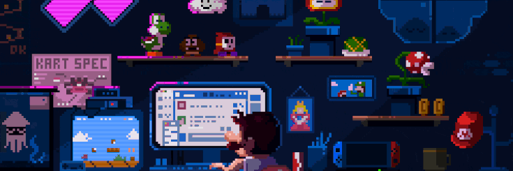
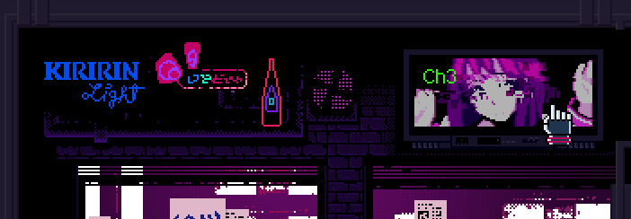
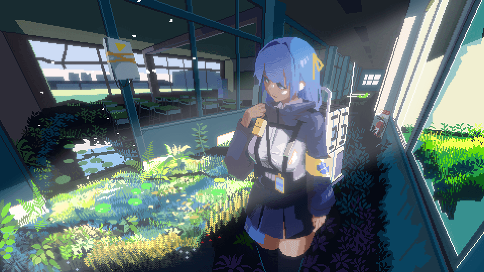

<div align="center">



<br/>

# `exprmnts`

**the codebase of onchain exprmnts**

*we're building the next MSCHF, but for the trenches.*

</div>

---

the most interesting ideas in crypto always start as exprmnts.
the meta moves insanely fast. running exprmnts on meta is the funnest thing we could possibly be doing.

we assembled a team from the trenches. our first product took 3 days to build.
it didn't take off — but it proved the only thing that mattered:

**we can ship really, really fast.**

<div align="center">



</div>

---

### `$ cat playbook.sh`

```bash
#!/bin/bash

start_with_a_thesis()
build_tight_exprmnt()

# each exprmnt must be:
# → time-bound
# → rule-defined
# → provably fair
# → buttery smooth

analyse_results()    # what happened vs what we predicted
next_exprmnt()       # never stop shipping
```

---

### `$ ls exprmnts/`

```
01_limited_loss_lotry_v2/       # fast cycle lottery. instant dopamine. seeded prize pool.
02_what_the_degen_doin/         # one minute social prediction. randomness meets mob psychology.
03_deflationary_reward_token/   # hold for higher odds. burn to enter. one massive final draw.
04_ai_kol/                      # auction a twitter bot's voice for 24h. winner controls the narrative.
05_split_or_steal_live/         # onchain split or steal. livestreamed. prediction markets.
06_universal_pinboard/          # pay to post. pay more to repaint. final canvas → NFT + physical.
07_nfc_breeding_game/           # blind box collabs. IRL meetups. breed rare NFC collectibles.
08_onchain_treasure_hunt/       # AR/VR clues. IRL exploration. prize pool at the end.
```

---

### `$ cat philosophy.md`

exprmnts aren't features. **exprmnts are the product.**

each exprmnt is:
- a chance to go viral
- a revenue event
- a cultural moment
- a fast feedback loop with real stakes

if an exprmnt shows breakout demand → we run seasons or spin it out into a full product.

this is how MSCHF built a brand with a tiny team.
we're doing it onchain.

---

<div align="center">



<br/><br/>

**`we ship. we test. we iterate. we win.`**

</div>
